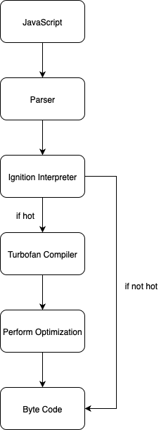

여러분, 안녕하세요!

최근 Google의 ASAN(Address Sanitizer)에 관한 심도 있는 기술 문서를 접한 이후, 브라우저 보안의 구조적 취약점과 관련한 학문적 관심이 한층 더 깊어졌습니다. 이 글에서는 자바스크립트 및 웹 어셈블리 엔진인 V8에 대한 기술적 배경과 그 구조를 정리하고, 향후 V8 기반의 1-day 취약점 분석을 위한 사전 이해로 활용될 수 있도록 내용을 체계적으로 서술하고자 합니다.

본격적인 기술 분석에 앞서, "V8"이라는 명칭 자체가 가지는 기원에 대해 흥미를 가졌고, 이에 대한 소소한 고찰로 글을 시작하려 합니다.일반적으로 "V8"이라는 단어는 자동차 공학 분야에서 8기통 엔진을 지칭하는 용어로 널리 사용됩니다. V형으로 배열된 8개의 실린더가 피스톤의 왕복 운동을 통해 강력한 동력을 생성하는 이 엔진은, 4000cc 이상의 고배기량을 바탕으로 탁월한 퍼포먼스를 자랑하기때문에 머슬카나 고성능 스포츠카, 대형 SUV 등에서 널리 채택되고 있으며, 연료 효율보다는 출력 성능이 강조되어 "기름 먹는 하마" 라는 별칭을 가지고 있기도합니다.

"8기통은 미국이 태생이다" 라고 많은 사람들이 오해를 하고 있지만, V8 엔진이 미국에서 처음 고안된 것은 아닙니다. 자원이 풍부한 미국은 8기통을 세계 최초로 양산을 시작한 나라일 뿐, 기술적 기원은 1901년 프랑스의 한 공학자 Léon Levavasseur로 거슬러올라갑니다. 그는 항공기에 사용할 엔진을 설계하면서 직렬 4기통의 기통 수를 6개로 늘리려는 기술적 한계를 극복하기 위해 많은 시행착오를 겪었습니다. 하지만 그가 고안해낸 방법으로는 크랭크 축이 길어져 엔진이 원활하게 작동 하지 않자 그는 깊은 고민에 빠져 고뇌하였습니다. 

시간이 흐른 뒤, 그는 직렬 4기통 2개를 결합하는 방법을 고안해내어 합쳐보는 시도를 하였고 이후 원활하게 동작하는 것을 확인하며, 현대적인 의미의 V8 구조가 처음으로 세상에 등장하게 되었습니다. 이처럼 강력한 힘을 자랑하며 기술적 완성도를 상징하는 8기통 엔진에서 영감을 받아 Google은 자사의 차세대 자바스크립트엔진 프로젝트에 "V8"이라는 명칭을 부여했습니다.

2006년 가을 "Lars Bak"이 Google과의 인연을 시작함으로써 그를 중심으로 한 소수의 엔지니어들이 덴마크의 한 농가 별채에서 V8 개발을 수행했습니다.

V8은 개발 중에는 Google의 내부 비밀 프로젝트로써 비공개 CVS(Concurrent Versions System) 저장소에서 개발되었습니다. 하지만 2008년 9월 2일, Google Chrome의 공식 출시와 함께 V8 역시 오픈소스로 전환되어 전 세계 개발자들에게 공개되었습니다. 기술적으로 V8은 자바스크립트 코드의 실행 속도를 극대화하는 데 초점을 맞춰 C++ 로 개발되었으며, JIT(Just In Time) 컴파일러를 채택했습니다. 

JIT 덕분에 실행 시점에 자바스크립트 코드를 기계어로 변환함으로써 성능을 극적으로 향상시킬 수 있는 구조적 장점을 가졌지만 C/C++계열 특성상 Coder가 메모리를 수동으로 관리해줘야 하기 때문에 해커들은 그들의 실수의 틈을 찾아내고 이로 인해 발생하는 Memory Curruption은 종종 보안 취약점으로 이어졌습니다. 실제로 미국 백악관에서는 메모리 안정성 이슈를 해소하기 위해 Rust와 같은 메모리 안전 언어 도입을 권고하기도 했습니다.

V8의 실행 구조는 다음과 같은 다단계로 구성됩니다.

    

<b>Parsing</b>  
우선 런-타임(Run-Time) 시점에 자바스크립트 소스코드는 Parser에 의해 AST(Abstract Syntax Tree)로 변환됩니다. 이는 프로그램의 구조를 트리 형태로 표현한 중간 표현이라고 생각하시면 됩니다.
<b>Ignition Interpreter</b>  
AST를 바탕으로 바이트코드를 생성하는 인터프리터입니다. 이 단계는 빠른 초기 실행을 위한 경량화된 인터프리터이며, 중복된 코드가 반복 실행되면 "hot" 패턴으로 인식되는데 그럼, Turbofan Compiler에서 추가적인 처리가 이루어집니다.
<b>Turbofan Compiler</b>  
Ignition Interpreter에서 생성된 바이트코드를 바탕으로 SSA(Static Single Assignment) 기반 최적화와 함께 기계어로 컴파일합니다. 이 컴파일러는 인라인 캐싱(Inline Caching), 히든 클래스(Hidden Class), 불필요한 연산 제거 등 고급 최적화 기법을 적용하여 퍼포먼스를 향상시킵니다.
<b>Perform Optimization</b>  
컴파일된 기계어는 캐시에 저장되어, 동일한 코드가 반복될 경우 재컴파일 없이 즉시 실행될 수 있도록 합니다.
<b>Byte Code</b>  
생성된 바이트코드를 실제 프로세서에서 실행됩니다.

즉, V8의 JIT 컴파일러는 기존 인터프리터 방식의 단점인 반복된 명령어 실행 시 매번 동일한 해석이 필요한 비효율성을 보완하여, 실시간으로 컴파일된 기계어를 재활용함으로써 구조적 성능을 비약적으로 향상시킵니다. 이러한 다단계 실행 파이프라인은 자바스크립트 실행 환경의 실질적인 속도 개선뿐만 아니라, 현대 웹 애플리케이션에서 요구하는 높은 반응성과 복잡도 처리를 가능하게 만든 핵심 요소라고 생각합니다.

다음 글에서는 이러한 V8 구조를 기반으로 한 최근의 1-day 취약점인 CVE-2023-2033를 중심으로, JIT 최적화 과정에서 발생 가능한 보안 취약점의 원인과 공격 벡터에 대해 분석해보고자 합니다.

### [ Reference ]
- https://blog.bitsrc.io/secret-behind-javascript-performance-v8-hidden-classes-ba4d0ebfb89d
- https://ko.wikipedia.org/wiki/V8_%EC%97%94%EC%A7%84
- https://oldmachinepress.com/2016/05/28/antoinette-levavasseur-aircraft-engines/
- https://rnfltpgus.github.io/knowledge/v8-engine/
- https://jaehyeon48.github.io/javascript/google-v8-engine/